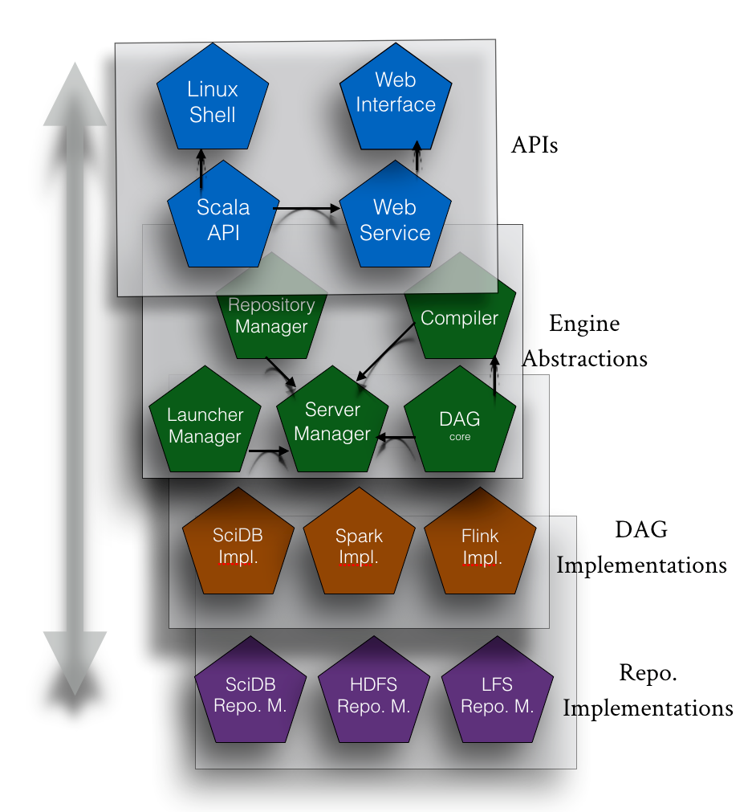

Genometric Query Language
=========================

GMQL is a declarative language for genomic region and metadata manipulation with a SQL-inspired syntax. With GMQL the user can perform complex queries on the basis of positional, categorical and numeric features of the datasets.

You can find more information about the language at the following links:
    * `Complete introduction to the GMQL language <http://www.bioinformatics.deib.polimi.it/genomic_computing/GMQLsystem/doc/GMQL_introduction_to_the_language.pdf>`_: here we explain all the operators of the GMQL language together with some explanatory examples.
    * `Explained examples and biological applications <http://www.bioinformatics.deib.polimi.it/genomic_computing/GMQLsystem/doc/GMQL_biological_examples.pdf>`_: here we present several complex queries showing the expressiveness of the language in a biological research setting.

NB: In order to use PyGMQL one should have at least clear the semantics of the GMQL operators, but the library is designed to be self contained and can be used without a strong background knowledge of the language.

GMQL engine
-----------

The GMQL engine is composed by various sub-systems:
    * *A repository*, which enables the user to store his/her datasets, the results of the queries and to access the public datasets shared between the users of the same GMQL instance
    * *An engine implementation*, which implements the GMQL operators. Currently the Spark engine is the most updated and complete implementation and it is the one used also by PyGMQL

GMQL WEB interface
------------------

The GMQL system is publicly available `at this link <http://genomic.elet.polimi.it/gmql-rest/>`_.