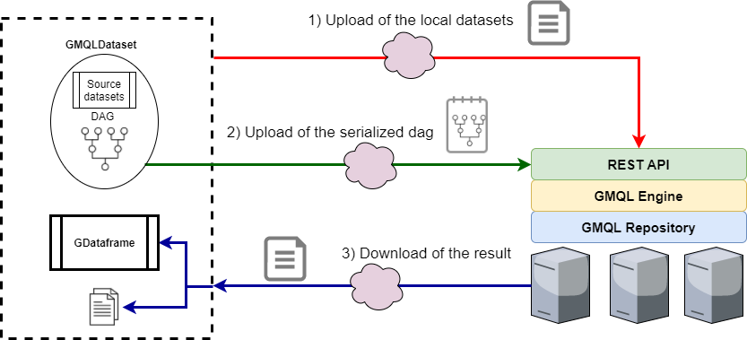

Remote data management
======================

PyGMQL can be used in two different ways. The first one (and the most intuitive and classical one)
is to use it like any other computational library.

PyGMQL also manages the execution through a remote server (or cluster). In order to use this
feature the user needs to login to the remote service before.

The web service offered by the GeCo group at Politecnico di Milano can be found at
http://genomic.elet.polimi.it/gmql-rest/

---------
Loggin in
---------

This can be done by firstly specifying the remote server address::

    import gmql as gl
    gl.set_remote_address("http://genomic.elet.polimi.it/gmql-rest/")

and then by logging in into the system::

    gl.login()

From this point on the user will be logged into the remote system.

----------------------------------
Guest users VS Authenticated users
----------------------------------

GMQL and PyGMQL enable two different ways to interact with the remote service. The users can be logged as:

* *Guest user*: the user doesn't need to register to the service and a only a limited storage and
  computational power is available for the queries. The access token (which is automatically
  handled by the library) will expire after a certain period of inactivity.
* *Authenticated user*: the user needs to register on the web interface before providing username, password and
  other information. The access token is stored and can be used for an unlimited amount of time.

By default, the sequence of operations that are shown above will log the user as *guest*.

In both cases a folder in the home directory of the user will be created with name :code:`.pygmql` and inside of it
there will be a :code:`sessions.xml` file which will store all the active sessions for the user.

--------------------------------
Logging as an authenticated user
--------------------------------

Once you are registered in the web service with a username and password, in order to use the same credentials also
in PyGMQL you have to use the :code:`pygmql_login` tool. This tool is automatically installed when the library is
downloaded and installed (both from github or pip).

On linux/MacOS:

.. code-block:: none

   pygmql.sh --login

On Windows:

.. code-block:: none

   pygmql_win --login

Once the tool is executed the following information will be asked:

* The http *address* of the remote service you want to access
* *Username*
* *Password*

-------------
Library modes
-------------

The library mode can be setted in the following way::

    gl.set_mode("remote") # remote processing of the following operations
    gl.set_mode("local")  # local processing of the following operations

Notice that the :meth:`~gmql.set_mode` will act only on the following :meth:`~gmql.dataset.GMQLDataset.GMQLDataset.materialize`
operations while the previous ones will be performed with the previous setted modality.

The default mode of PyGMQL is local.

=========================
The remote execution mode
=========================
When the user sets the remote mode and calls the :meth:`~gmql.dataset.GMQLDataset.GMQLDataset.materialize` operation, the
following actions will be performed

1. The local datasets that are used are uploaded to the remote service. Nothing is done to the remote datasets used in the query (if present)
   since they are already on the server.
2. A compressed representation of the query is sent to the remote service, decoded and executed
3. Once the execution is complete, the results are downloaded, stored and loaded into a :meth:`~gmql.dataset.GDataframe.GDataframe`.

